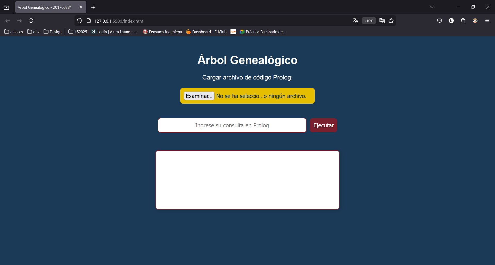
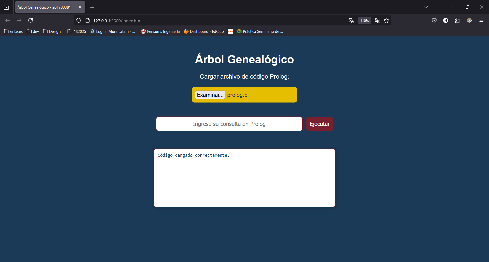
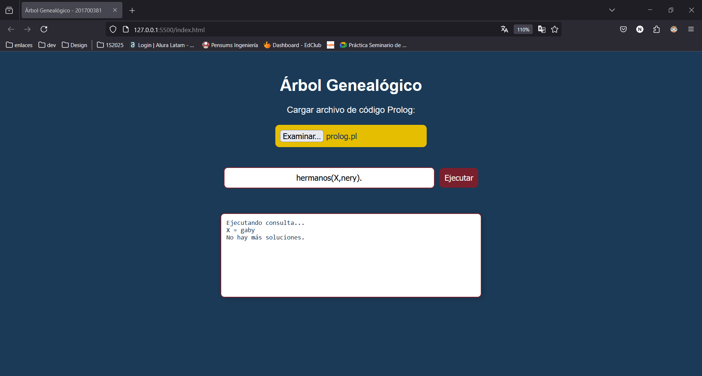
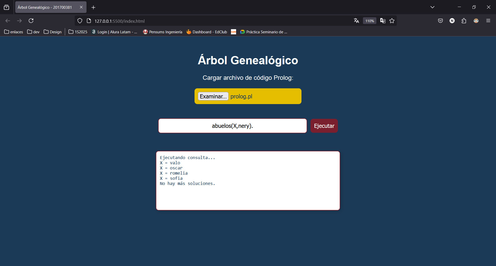
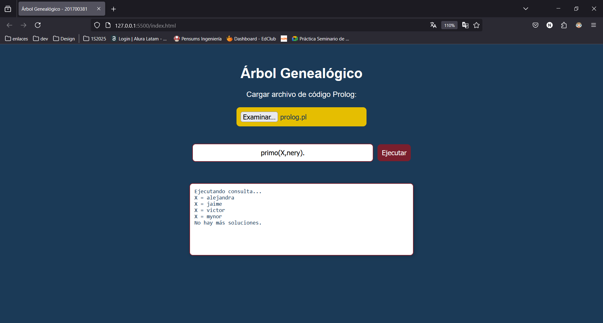

# Nery Oswaldo Jiménez Contreras - 201700381

## Carga de archivo Prolog

## Capturas de respuestas
Se tienen cuatro categorías: hermanos, abuelos, tíos y primos

## Hermanos

## Abuelos

## Tíos

## Primos

